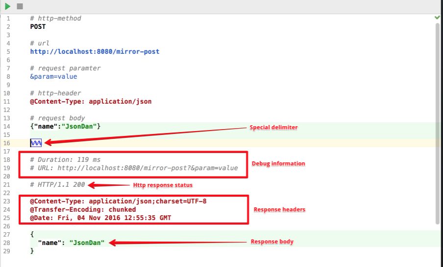

This plugin helps you to run http-requests from an IDEA's text editor

#### Features
- Supports GET, POST, PUT, DELETE, PATCH requests
- Multiline request parameters
- Response auto format (based on response Content-Type header)
- Customized colors and fonts
- Customized keyboard shortcuts
- Comments



#### YouTube demos 

* [Simple demo](https://www.youtube.com/watch?v=AliJaGmXlxc)

```bash
http://localhost:8080/test
@Content-type: application/json
%%%

# Duration: 539 ms
# URL: http://localhost:8080/test

# HTTP/1.1 200

@Content-Type: application/json;charset=UTF-8
@Transfer-Encoding: chunked
@Date: Fri, 04 Nov 2016 08:51:00 GMT

{
  "id": 2,
  "name": "resp name",
  "item": [
    {
      "id": 21,
      "name": "item 1",
      "price": 1
    },
    {
      "id": 22,
      "name": "item 2",
      "price": 10
    }
  ]
}
```

* [POST demo](https://www.youtube.com/watch?v=s4oVpfAJHFM)

```bash
POST
http://localhost:8080/mirror-post
@Content-Type: application/json
{"name":"JsonDan"}
%%%

# Duration: 501 ms
# URL: http://localhost:8080/mirror-post

# HTTP/1.1 200

@Content-Type: application/json;charset=UTF-8
@Transfer-Encoding: chunked
@Date: Fri, 04 Nov 2016 11:59:34 GMT

{
  "name": "JsonDan"
}
```

* [Request params demo](https://www.youtube.com/watch?v=Gt8OnWPiJUY)

```bash
http://localhost:8080/mirror-params?one=1
#&two=2&three=3
#&four=4
&five=5
%%%

# Duration: 666 ms
# URL: http://localhost:8080/mirror-params?one=1&five=5

# HTTP/1.1 200

@Content-Type: text/plain;charset=ISO-8859-1
@Content-Length: 14
@Date: Fri, 04 Nov 2016 12:19:52 GMT

one: 1
five: 5
```
